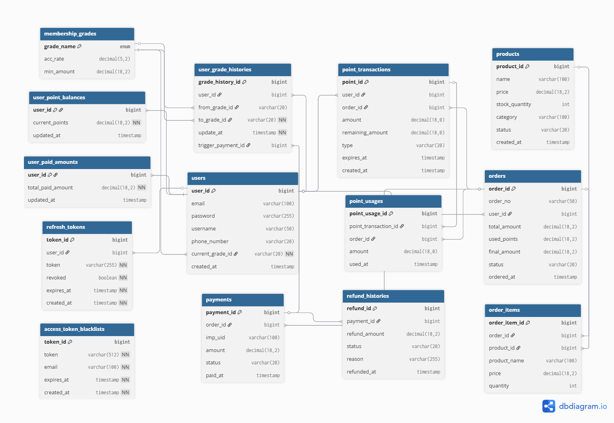

# 결제 시스템 프로젝트

---

- 팀명: 1찍끝내조
- 팀장: 윤민기
- 팀원: 김수민, 이한비, 이준연, 김재진

**개발 기간**: 2026.02.04 ~ 2026.02.15

## 목차

1. [프로젝트 개요](#1-프로젝트-개요)
2. [기술 스택](#2-기술-스택)
3. [프로젝트 패키지 구조](#3-프로젝트-패키지-구조)
4. [실행 방법 / 환경 설정](#4-실행-방법--환경-설정)
5. [도메인별 주요 기능 정리](#5-도메인별-주요-기능)
6. [API 명세서](#6-api-명세서)
7. [ERD](#7-erd)
8. [비즈니스 로직 플로우차트](#8-비즈니스-로직-플로우차트)
9. [테스트코드 작성 현황](#9-테스트코드-작성-현황-)

---

## 1. 프로젝트 개요

### 1-1. 프로젝트 소개

**PortOne API를 활용한 커머스 주문·결제·환불 시스템**

포인트 적립/사용, 멤버십 등급 자동화, 복합 결제(포인트 + PG사), 환불 처리를 포함한
 커머스 결제 시스템을 구현했습니다.
<br/><br/>

**개발 기간**
> 2026.02.04 ~ 2026.02.15

**팀 구성**
- 팀명: 1찍끝내조
- 팀장: 윤민기
- 팀원: 김수민, 이한비, 이준연, 김재진
<br/><br/>

### 1-2. 팀원 역할 분담

| 이름  | 담당 도메인    |
|-----|-----------|
| 윤민기 | 결제        |
| 김수민 | 포인트       |
| 이한비 | 유저 / 멤버십  |
| 이준연 | 환불        |
| 김재진 | 주문 / 주문 상품 / 상품 |
<br/>


### 1-3. 프로젝트 핵심 목표
| 관점 | 내용 |
|------|------|
| **기술적 관점** | 복합 결제 트랜잭션 관리, PG사 결제 API 연동, 보상 트랜잭션 구축 |
| **역량 관점** | 비즈니스 로직 구체화, 복잡한 도메인 설계 및 의존성 관리, 시스템 처음부터 설계·구현 |
| **비즈니스 관점** | 고객 락인(Lock-in) 전략, 복잡한 결제 시나리오 예외 대응 |
<br/>


### 1-4. 주요 요구사항

<details markdown="1">
  <summary><b>상품 및 주문</b></summary>
  <div>
    <ul>
      <li>결제를 위한 기본 상품 정보(가격, 재고, 상태) 조회 기능</li>
      <li>장바구니 없이 <b>즉시 주문 생성</b>, 초기 상태는 <code>결제 대기(PENDING_PAYMENT)</code></li>
      <li>주문 상세 조회 시 결제 상태, 사용/적립 포인트 요약 포함</li>
    </ul>
  </div>
</details>

<details markdown="1">
  <summary><b>사용자 및 인증</b></summary>
  <div>
    <ul>
      <li><b>Spring Security + JWT</b>를 이용한 인증/인가</li>
      <li>"내 주문", "내 포인트" 등 <b>본인 데이터만 접근 가능</b>하도록 소유권 제한</li>
      <li>회원 필수 정보: 이메일, 전화번호, 이름</li>
    </ul>
  </div>
</details>

<details markdown="1">
  <summary><b>결제 시스템 (PortOne 연동)</b></summary>
  <div>
    <ul>
      <li><b>결제 흐름</b>: 주문 생성 → 결제 시도 기록(DB) → PortOne 결제창 → 서버 검증(Confirm) → 최종 확정</li>
      <li><b>금액 검증</b>: 클라이언트 값이 아닌 <b>PortOne API 조회 결과</b>를 기준으로 금액/상태 일치 여부 확인</li>
      <li><b>멱등성 보장</b>: 중복 결제 및 중복 웹훅 처리 방지 (Unique Key 활용)</li>
      <li><b>보상 트랜잭션</b>: 외부 결제 성공 but 내부 DB 실패 시, 자동으로 결제 취소 API 호출</li>
    </ul>
  </div>
</details>

<details markdown="1">
  <summary><b>포인트 관리</b></summary>
  <div>
    <ul>
      <li>모든 변동(적립, 사용, 소멸, 취소, 복구)을 <code>point_transactions</code>에 <b>이력으로 기록</b></li>
      <li>조회 성능을 위해 사용자 테이블에 <b>현재 잔액 스냅샷</b> 유지</li>
      <li>적립 시 설정된 만료일에 따라 <b>스케줄러를 통한 자동 소멸</b> 처리</li>
      <li><b>복합 결제</b>: 포인트 전액 결제 또는 포인트 + 카드 혼합 결제 지원</li>
    </ul>
  </div>
</details>

<details markdown="1">
  <summary><b>멤버십 등급 자동화</b></summary>
  <div>
    <ul>
      <li>총 결제 금액(<code>PAID</code> 상태) 기준으로 <b>자동 등급 부여</b></li>
      <li><b>NORMAL</b>: 5만원 이하 (1% 적립)</li>
      <li><b>VIP</b>: 5만원 초과 ~ 15만원 미만 (5% 적립)</li>
      <li><b>VVIP</b>: 15만원 이상 (10% 적립)</li>
      <li><b>갱신 시점</b>: 결제 완료 시 즉시 등급 업그레이드, 환불 시 즉시 등급 다운그레이드</li>
    </ul>
  </div>
</details>

<details markdown="1">
  <summary><b>환불 및 취소</b></summary>
  <div>
    <ul>
      <li><code>주문 완료</code> & <code>결제 완료</code> 상태에서만 <b>전액 환불</b> 가능</li>
      <li>사용했던 포인트는 <b>복구</b>, 결제 시 적립된 포인트는 <b>회수</b></li>
      <li>환불 이력을 별도 테이블에 기록하고, 총 결제 금액 및 멤버십 등급 재산출</li>
    </ul>
  </div>
</details>

<br/>

---

## 2. 기술 스택

| 분류            | 기술 |
|---------------|------|
| **Language**  | Java 17 |
| **Framework** | Spring Boot, Spring MVC, Spring Security |
| **ORM / DB**  | Spring Data JPA, MySQL |
| **인증/인가**     | JWT (Access Token + Refresh Token) |
| **외부 API**    | PortOne - KG이니시스 PG 연동 |
| **빌드 도구**     | Gradle |
| **라이브러리**     | Lombok, Jakarta EE |
| **스케줄링**      | Spring Scheduler |
| **뷰 템플릿**     | Thymeleaf |

---

## 3. 프로젝트 패키지 구조

<details markdown="1">
  <summary>payment-api-system 패키지 구조</summary>
  <div>

```
src/main/java/com/bootcamp/paymentdemo
│
├── common                     → 공통 모듈 (BaseEntity, 응답 DTO, 글로벌 예외 처리)
│   ├── dto
│   ├── entity
│   ├── exception
│   └── BaseEntity.java
│
├── config                     → 스프링 설정 (Security, CORS, PortOne, JPA Auditing 등)
│
├── security                   → 인증/인가 (JWT 필터, 토큰 Provider, 블랙리스트 스케줄러)
│   ├── entity
│   ├── filter
│   ├── provider
│   ├── service
│   ├── scheduler
│   ├── controller
│   └── repository
│
├── external                   → 외부 API 연동
│   └── portone                → PortOne(아임포트) 클라이언트, DTO, 에러/예외 처리
│       ├── dto
│       ├── client
│       ├── error
│       └── exception
│
├── user                       → 사용자 (회원가입, 로그인, 내 정보 조회)
│   ├── dto
│   ├── entity
│   ├── service
│   ├── exception
│   └── repository
│
├── membership                 → 멤버십 (등급 정책 조회, 자동 등급 갱신, 이력 관리)
│   ├── dto
│   ├── entity
│   ├── service
│   ├── exception
│   ├── controller
│   └── repository
│
├── product                    → 상품 (상품 조회, 재고 차감/복구)
│   ├── dto
│   ├── consts
│   ├── entity
│   ├── service
│   ├── exception
│   ├── controller
│   └── repository
│
├── order                      → 주문 (주문 생성, 상태 관리, 자동 확정 스케줄러)
│   ├── dto
│   ├── consts
│   ├── entity
│   ├── service
│   ├── exception
│   ├── scheduler
│   ├── controller
│   └── repository
│
├── orderProduct               → 주문 상품 (스냅샷 패턴 - 주문 시점 상품 정보 저장)
│   ├── entity
│   └── repository
│
├── payment                    → 결제 (사전등록, PG 검증, 복합 결제, 보상 트랜잭션)
│   ├── dto
│   ├── consts
│   ├── entity
│   ├── service
│   ├── controller
│   └── repository
│
├── refund                     → 환불 (환불 처리, 중복 방지, 이력 관리)
│   ├── dto
│   ├── consts
│   ├── entity
│   ├── service
│   ├── exception
│   ├── controller
│   └── repository
│
├── point                      → 포인트 (적립/사용/소멸, FIFO 관리, 정합성 보정 스케줄러)
│   ├── dto
│   ├── consts
│   ├── entity
│   ├── service
│   ├── scheduler
│   ├── controller
│   └── repository
│
├── webhook                    → 웹훅 (PortOne 웹훅 수신 및 처리)
│   ├── dto
│   ├── entity
│   ├── service
│   ├── controller
│   └── repository
│
├── frontend                   → 프론트엔드 뷰 (Thymeleaf 페이지 컨트롤러)
│   ├── dto
│   └── controller
│
└── PaymentDemoApplication.java
```
  </div>
</details>


---

## 4. 실행 방법 / 환경 설정

#### 4-1. 사전 준비
- MySQL 실행
- DB 생성 : `sql CREATE DATABASE payment;`
- `application-local.yml` 파일을 추가해 아래 항목을 본인의 환경에 맞게 설정합니다.
    ```yaml
    spring:
      datasource:
        url: jdbc:mysql://localhost:3306/payment
        username: {DB_USERNAME}
        password: {DB_PASSWORD}
        
      # local 환경에서만 data.sql 실행
      sql:
        init:
          mode: always  # always: 항상 실행 (개발 환경에서만)
          encoding: UTF-8
          continue-on-error: false  # 오류 발생 시 중단
    ```
  >참고
    >- ddl-auto=create는 실행할 때마다 테이블이 다시 생성됩니다.
    >- 데이터를 유지하려면 update로 변경해서 사용합니다.

#### 4-2. 브라우저 접속
 - URL: http://localhost:8080


---
## 5. 도메인별 주요 기능

### 결제 (Payment)

| 기능 | 설명 |
|------|------|
| **결제 장부 사전 생성** | PG 연동 전 장부를 미리 생성하고 포인트를 선검증하여 비정상 결제 요청을 원천 차단 |
| **비관적 락 동시성 제어** | DB `PESSIMISTIC_WRITE` 잠금으로 중복 결제 요청 및 웹훅 동시 진입 시 멱등성 보장 |
| **결제 금액 교차 검증** | DB 예상 금액과 PG사 실제 승인 금액을 대조, 불일치 시 즉각 결제 취소 |
| **보상 트랜잭션** | 내부 로직 예외 발생 시 PG사 결제 자동 취소 후 롤백하여 자금·데이터 정합성 유지 |

### 환불 (Refund)

| 기능 | 설명 |
|------|------|
| **비관적 락** | 환불 시작 시점에 DB 레벨 락을 걸어 중복 환불 요청 중 하나만 처리 보장 |
| **트랜잭션 전파 전략** | 메인 트랜잭션 롤백 시에도 환불 요청/실패 이력은 독립 트랜잭션으로 저장 |
| **중복 환불 방지** | 이미 취소된 주문·이미 환불된 결제·잘못된 결제 상태·중복 환불 요청을 사전 차단 |
| **정적 팩토리 메서드** | 상태별 명확한 의미의 생성자 메서드를 제공, 잘못된 상태의 객체 생성 방지 |
| **단일 책임 분리** | 환불 완료 후 결제/주문 상태 변경, 재고 복구, 멤버십 갱신을 각 도메인 서비스에 위임 |

### 포인트 (Point)

| 기능 | 설명 |
|------|------|
| **적립 / 사용 / 환불 / 소멸** | 포인트 라이프사이클 전체를 관리 |
| **FIFO 방식 포인트 관리** | 만료일 임박한 포인트부터 우선 사용하여 소멸 손실 최소화 |
| **정합성 이중 보장** | `UserPointBalance`(스냅샷)로 조회 성능 최적화 + `PointTransaction`(전체 내역 SUM)으로 정합성 보장 |
| **스케줄러 자동화** | 매일 00:00 만료 포인트 자동 소멸 / 매일 00:30 스냅샷 정합성 자동 보정 |

### 상품 (Product)

| 기능 | 설명 |
|------|------|
| **재고 차감** | 주문 생성 시 상품 재고 차감 |
| **재고 복구** | 주문 취소 및 환불 시 차감된 재고 복구 |

### 주문 (Order)

| 기능 | 설명 |
|------|------|
| **주문 번호 자동 생성** | `ORD-yyyyMMdd-XXXX` 형식, 당일 누적 주문 수 기반 일련번호 자동 넘버링 |
| **주문 상태 흐름** | `PENDING_PAYMENT` → `PENDING_CONFIRMATION` → `CONFIRMED` / `CANCELLED` |
| **포인트 사전 검증** | 주문 생성(`PENDING_PAYMENT`) 단계에서 포인트를 처리하지 않고 사용 가능 여부 검증 및 적립 예정 포인트 계산만 수행 |
| **단계별 포인트 처리** | 결제 완료 시 포인트 차감 → 주문 확정 시 적립 지급 → 취소 시 사용 포인트 복구 |
| **자동 주문 확정 스케줄러** | 일정 시간마다 `PENDING_CONFIRMATION` 상태 주문을 `CONFIRMED`로 자동 변경 |

### 주문 상품 (OrderProduct)

| 기능 | 설명 |
|------|------|
| **스냅샷 패턴** | 주문 생성 시점의 상품명과 가격을 복사하여 저장, 이후 상품 정보 변경에 영향받지 않음 |

### 유저 (User)

| 기능 | 설명                                                   |
|------|------------------------------------------------------|
| **JWT 이중 토큰 전략** | Access Token + Refresh Token 발급으로 보안 확보              |
| **Access Token 블랙리스트** | 로그아웃한 Access Token을 블랙리스트에 등록하여 만료 전 사용 차단           |
| **다중 로그인 제어** | 새로운 로그인 시 이전 Refresh Token 자동 무효화 (`revoked = true`) |
| **토큰 자동 갱신** | Access Token 만료 시 Refresh Token으로 재발급, 재로그인 불필요      |
| **블랙리스트 자동 정리** | 스케줄러를 통해 매일 00:00 만료된 Access Token 블랙리스트에서 자동 삭제     |
| **Spring Security 통합** | 필터 체인을 통한 JWT 검증 및 인증/인가 처리로 결제·환불·포인트 API 보호        |

### 멤버십 (Membership)

| 등급 | 기준 금액 | 포인트 적립률 |
|------|----------|-------------|
| **NORMAL** | 5만원 이하 | 1% |
| **VIP** | 5만원 초과 ~ 15만원 미만 | 5% |
| **VVIP** | 15만원 이상 | 10% |

| 기능 | 설명 |
|------|------|
| **실시간 자동 등급 갱신** | `주문 확정` 시 누적 결제 금액 증가로 등급 자동 상승, `환불` 시 금액 감소로 등급 자동 하락 |
| **등급 변경 이력 추적** | 변경 전/후 등급, 사유(주문 확정/환불), 트리거 주문 ID, 변경 시각을 모두 기록 |
| **집계 테이블 분리** | `user_paid_amounts` 테이블로 누적 결제 금액 별도 관리 |

---

## 6. API 명세서

공통 사항
- API Header
  - Content-Type: application/json
  - Authorization: Bearer {TOKEN} (회원가입, 로그인 제외)

### 유저(User) API
<details>
  <summary>유저(User)</summary>
  <div markdown="1">

### 1. 회원가입
- URL: `/api/signup`
- Method: `POST`
- Request Body:
    ```json
    {
          "username": "테스트",
          "email": "test1@example.com",
          "password": "password123",
          "phoneNumber": "010-1111-2222"
    }
    ```

- Response:
    ```json
    {
        "success": true,
        "code": 201,
        "message": "회원가입 성공",
        "data": {
          "userId": 1,
          "email": "test1@example.com"
        }
    }
    ```
- Response Code `201 Created`
- ERROR
    
  - 입력값 검증 실패: 400 Bad Request
  - 이미 존재하는 이메일인 경우: 409 Conflict

### 2. 로그인

- URL: `/api/login`
- Method: `POST`
- Request Body:
    ```json
    {
          "email": "test1@example.com",
          "password": "password123"
    }
    ```

- Response:
    ```json
    {
        "success": true,
        "code": 200,
        "message": "성공",
        "data": {
          "email": "user@example.com",
          "accessToken": "Bearer ..."
        }
    }
    ```
- Response Code `200 OK`
- ERROR

    - 입력값 검증 실패: 400 Bad Request
    - 잘못된 비밀번호일 경우: 401 Unauthorized

### 3. 로그아웃

- URL: `/api/logout`
- Method: `POST`
- Request Body:

- Response:
    ```json
    {
        "success": true,
        "code": 200,
        "message": "로그아웃 성공",
        "data": {} 
    }
    ```
- Response Code `200 OK`
- ERROR

    - 사용자 없음: 400 Bad Request
    - 인증 실패(토큰 없음/만료): 401 Unauthorized

### 4. 내 정보 조회

- URL: `/api/me`
- Method: `GET`
- Request Body:
- Response:
    ```json
    {
        "success": true,
        "code": 200,
        "message": "성공",
        "data": {       
            "userId": "1",
            "email": "user@test.com",
            "name": "테스트",
            "phone": "010-1234-5678",
            "pointBalance": 0.00,
           "totalPaidAmount": 0.00,
           "currentGrade": "NORMAL"
        }
    }
    ```
- Response Code `200 OK`
- ERROR

  - 토큰 없이 보호된 API 접근할 경우: 401 Unauthorized

    </div>
</details>

### 상품(Product) API
<details markdown="1">
  <summary>상품(Product)</summary>
  <div>

### 1. 상품 목록 조회

- URL: `/api/products`
- Method: `GET`
- Request Body:

- Response:
    ```json
    {
       "success": true,
       "code": 200,
       "message": "성공",
       "data": [
            {
              "product_id": 1,
              "name": "기계식 키보드",
              "price": 150000,
              "stock_quantity": 10,
              "status": "ON_SALE",
              "category": "ELECTRONICS"
            },
            {
              "product_id": 2,
              "name": "게이밍 마우스",
              "price": 50000,
              "stock_quantity": 5,
              "status": "ON_SALE",
              "category": "ELECTRONICS"
            }
       ]
    }
    ```
- Response Code `200 OK`
- ERROR

    - 서버 내부 오류: 500 Internal Server Error

### 1. 상품 단건 조회

- URL: `/api/products/{productId}`
- Method: `GET`
- Request Body:

- Response:
    ```json
    {
        "success": true,
        "code": 200,
        "message": "성공",
        "data": {
            "product_id": 1,
            "name": "기계식 키보드",
            "price": 150000,
            "stock_quantity": 10,
            "description": "무선 사용이 가능한 청축 기계식 키보드.",
            "status": "ON_SALE",
            "category": "ELECTRONICS"
        }
    }
    ```
- Response Code `200 OK`
- ERROR
  - 존재하지 않는 상품 조회 요청: 404 Not Found
  - 잘못된 상품ID 형식: 400 Bad Request
  
  </div>
</details>

### 주문(Order) API
<details markdown="1">
  <summary>주문(Order)</summary>
  <div>

### 1. 주문 생성

- URL: `/api/orders`
- Method: `POST`
- Request Body:
    ```json
    {
        "userId": 1,
          "order_items": [
            {
                "product_id": 1,
                "stock_quantity": 1
            },
            {
                "product_id": 2,
                "stock_quantity": 2
            }
        ]
      }
  ```

- Response:
    ```json
    {
        "success": true,
        "code": 201,
        "message": "주문 생성 성공",
        "data": {
            "order_id": 2,
            "order_no": "ORD-20260205-0001",
            "total_amount": 250000,
            "status": "PAYMENT_WAITING",
            "ordered_at": "2026-02-05T14:30:00"
        }
    }
  ```
- Response Code `201 Created`
- ERROR

    - 재고 부족, 1회 최대 주문 수량 초과, 유효하지 않은 상품 ID 포함 시: 400 Bad Request
    - 인증 실패(토큰 없음/만료): 401 Unauthorized


### 2. 주문 내역 조회

- URL: `/api/orders`
- Method: `GET`
- Request Body:
- Response:
    ```json
    {
        "success": true,
        "code": 200,
        "message": "성공",
        "data": [
           {
              "order_id": 2,
              "order_no": "ORD-20260205-0001",
              "total_amount": 250000,
              "status": "PAYMENT_WAITING",
              "ordered_at": "2026-02-05T14:30:00"
           },
           {
              "order_id": 1,
              "order_no": "ORD-20260201-0001",
              "total_amount": 15000,
              "status": "ORDER_COMPLETED",
              "ordered_at": "2026-02-01T09:00:00"
           }
        ]
    }
    ```
- Response Code `200 OK`
- ERROR
    - 인증 실패(토큰 없음/만료): 401 Unauthorized

### 3. 주문 상세 조회

- URL: `/api/orders/{orderId}`
- Method: `GET`
- Request Body:
- Response:
  ```json
  {
        "success": true,
        "code": 200,
        "message": "성공",
        "data": {
          "order_id": 2,
          "order_no": "ORD-20260205-0001",
          "userId": 1,
          "total_amount": 250000,
          "status": "PAYMENT_WAITING",
          "ordered_at": "2026-02-05T14:30:00",
          "order_items": [
            {
              "order_items_id": 1,
              "product_id": 1,
              "name": "기계식 키보드",
              "price": 150000,
              "stock_quantity": 1
            },
            {
              "order_items_id": 2,
              "product_id": 2,
              "name": "게이밍 마우스",
              "price": 50000,
              "stock_quantity": 2
            }
          ]
        }
  }
    ```

- Response Code `200 OK`
- ERROR
    - 본인의 주문이 아닌 경우 조회 불가: 403 Forbidden
    - 존재하지 않는 주문 ID: 404 Not Found


### 4. 주문 확정

- URL: `/api/orders/{orderId}/confirm`
- Method: `PATCH`
- Request Body:
    ```json
    {
        "status": "CONFIRMED"
    }
  ```

- Response:
    ```json
    {
      "success": true,
      "code": 200,
      "message": "주문 상태 변경 성공",
      "data": {
        "order_id": 2,
        "status": "CONFIRMED",
        "updated_at": "2026-02-05T14:35:00"
      }
    }   
  ```
- Response Code `200 OK`
- ERROR

    - 불가능한 상태 변경 시도: 400 Bad Request
    - 권한 없음: 403 Forbidden
    - 주문 없음: 404 Not Found


  </div>
</details>

### 결제(Payment) API
<details markdown="1">
  <summary>결제(Payment)</summary>
  <div>

### 1. 결제 준비(장부 생성)

- URL: `/api/payment/create`
- Method: `POST`
- Request Body:
    ```json
    {
        "order_id": 2,
	    "totalAmount" : 1000,
	    "usePoint" : 100
    }
  ```

- Response:
    ```json
    {
        "success": true,
        "code": 200,
        "message": "성공",
        "data": {
	        "success" : true,
	        "paymentId" : 12345678,
	        "status" : "Pending"
      }
    }   
  ```
- Response Code `200 OK`
- ERROR


### 2. 결제 확정

- URL: `/api/payment/{dbPaymentId}/confirm`
- Method: `POST`
- Request Body:
- Response:
    ```json
    {
        "success": true,
        "code": 200,
        "message": "성공",
        "data": {
            "order_id": 2,
            "order_no": "ORD-20260205-0001",	
	        "success" : true,
	        "paymentId" : 12345678,
	        "status" : "Paid"
        }
    }
  ```
- Response Code `200 OK`
- ERROR

    - paymentId 가 DB내에 존재하는것과 올바르지 않을 때: 404 Not Found
    - 이미 처리된 결제일때: 400 Bad Request


  </div>
</details>

### 환불(Refund) API
<details markdown="1">
  <summary>환불(Refund)</summary>
  <div>

### 전액 환불 처리

- URL: `/api/refunds/{dbPaymentId}`
- Method: `POST`
- Request Body:
    ```json
    {
        "reason": "상품 불량"
    }
  ```

- Response:
    ```json
    {
        "success": true,
        "code": 200,
        "message": "성공",
        "data": {
	        "orderId": 1,
            "status": "환불 완료"
        }
    }   
  ```
- Response Code `200 OK`
- ERROR

    - 인증 실패(토큰 없음/만료): 401 Unauthorized
    - 결제 정보를 찾을 수 없을 경우: 404 Not Found
    - 환불을 진행할 수 없는 상태일 경우: 409 Conflict

  </div>
</details>

### 포인트 (Point) API
<details markdown="1">
  <summary>포인트 (Point)</summary>
  <div>

### 포인트 이력 조회

- URL: `/api/points`
- Method: `GET`
- Request Body:

- Response:
    ```json
    {
      "success": true,
      "code": 200,
      "message": "성공",
      "data": [
	      {
          "id": 4,
          "orderId": "ORD-20260205-0003",
          "points": -500,
          "type": "SPENT",
          "createdAt": "2026-02-05T21:00:00",
          "expiresAt": null
        },
	    {
          "id": 3,
          "orderId": null,
          "points": -300,
          "type": "EXPIRED",
          "createdAt": "2026-02-05T18:00:00",
          "expiresAt": null
        },
        {
          "id": 2,
          "orderId": "ORD-20260205-0001",
          "points": 200,
          "type": "REFUNDED",
          "createdAt": "2026-02-05T14:00:00",
          "expiresAt": null
        },
        {
          "id": 1,
          "orderId": "ORD-20260205-0002",
          "points": 500,
          "type": "EARNED",
          "createdAt": "2026-02-05T09:00:00",
          "expiresAt": "2027-02-05T09:00:00"
        }
      ]
    }
  ```
- Response Code `200 OK`
- ERROR

    - 인증 실패(토큰 없음/만료): 401 Unauthorized
  </div>
</details>

### 멤버십 (Membership) API
<details markdown="1">
  <summary>멤버십 (Membership)</summary>
  <div>

### 등급 정책 조회

- URL: `/api/membership`
- Method: `GET`
- Request Body:

- Response:
   ```json
    {
        "success": true,
        "code": 200,
        "message": "성공",
        "data": [
            {
              "gradeName": "NORMAL",
              "accRate": 1.00,
              "minAmount": 0.00
            },
            {
              "gradeName": "VIP",
              "accRate": 5.00,
              "minAmount": 50001.00
            },
            {
              "gradeName": "VVIP",
              "accRate": 10.00,
              "minAmount": 150000.00
            }
        ]
    }

    ```
- Response Code `200 OK`
- ERROR

    - 인증 실패(토큰 없음/만료): 401 Unauthorized


  </div>
</details>


---

## 7. ERD


---

## 8. 비즈니스 로직 플로우차트


---

## 9. 테스트코드 작성 현황 

| 도메인        | 테스트 클래스                          | 테스트 유형 |
|------------|----------------------------------|--------|
| Security   | AuthControllerTest               | 단위     |
| User       | UserServiceIntegrationTest       | 통합     |
| User       | UserServiceTest                  | 단위     |
| Product    | ProductControllerTest            | 통합     |
| Product    | ProductServiceTest               | 통합     |
| Order      | OrderControllerTest              | 통합     |
| Order      | OrderServiceTest                 | 통합     |
| Payment    | PaymentControllerIntegrationTest | 통합     |
| Payment    | PaymentTest                      | 단위     |
| Payment    | PaymentServiceTest               | 단위     |
| Refund     | RefundControllerTest             | 통합     |
| Refund     | RefundServiceTest                | 단위     |
| Point      | PointControllerTest              | 단위     |
| Point      | PointServiceIntegrationTest      | 통합     |
| Point      | PointServiceTest                 | 단위     |
| Membership | MembershipControllerTest         | 단위     |
| Membership | MembershipServiceTest            | 통합     |

### 주요 검증 항목

<details markdown="1">
  <summary>User(인증/인가)</summary>
  <div>
    <ul>
        <li>회원가입 성공 및 이메일 중복 검증</li>
        <li>BCrypt 비밀번호 암호화 확인</li>
        <li>로그인 성공 및 JWT 토큰 발급</li>
        <li>다중 로그인 시 이전 Refresh Token 무효화</li>
        <li>로그아웃 시 Refresh Token 무효화 + Access Token 블랙리스트 추가</li>
        <li>사용자 정보 조회 (포인트, 등급, 결제 금액)</li>
    </ul>
  </div>
</details>

<details markdown="1">
  <summary>Product (상품)</summary>
  <div>
    <ul>
        <li>상품 목록 조회 및 단건 조회</li>
        <li>재고 차감 성공 및 재고 부족 예외 처리</li>
        <li>재고 복구 성공</li>
        <li>잘못된 수량(0, 음수) 입력 예외 처리</li>
        <li>존재하지 않는 상품 예외 처리</li>
    </ul>
  </div>
</details>

<details markdown="1">
  <summary>Order (주문)</summary>
  <div>
    <ul>
        <li>주문 생성 성공 (포인트 사용 O/X)</li>
        <li>주문 번호 자동 생성 (ORD-yyyyMMdd-XXXX)</li>
        <li>주문 목록 조회 및 상세 조회</li>
        <li>주문 확정 성공 및 결제 미완료 시 확정 실패</li>
        <li>포인트 사전 검증 (사용 가능 여부)</li>
    </ul>
  </div>
</details>

<details markdown="1">
  <summary>Payment (결제)</summary>
  <div>
    <ul>
        <li>결제 장부 생성 (포인트 사용 O/X)</li>
        <li>포인트 잔액 부족 시 예외 처리</li>
        <li>결제 확정 성공 (PortOne 금액 일치 검증)</li>
        <li>금액 불일치 시 자동 결제 취소 (보상 트랜잭션)</li>
        <li>내부 로직 오류 시 자동 결제 취소 (보상 트랜잭션)</li>
        <li>결제 상태 변경 (PENDING → PAID)</li>
        <li>Entity 비즈니스 로직 (completePayment, isAlreadyProcessed, cancelPointUsage, refund)</li>
        <li></li>
    </ul>
  </div>
</details>

<details markdown="1">
  <summary>Point (포인트)</summary>
  <div>
    <ul>
        <li>포인트 내역 조회 (페이징)</li>
        <li>포인트 잔액 조회 (실시간 SUM)</li>
        <li>포인트 적립 (주문 확정 시)</li>
        <li>포인트 사용 (FIFO 방식 - 만료일 임박 순)</li>
        <li>포인트 환불 복구</li>
        <li>포인트 자동 소멸 (만료일 경과)</li>
        <li>스냅샷 정합성 자동 보정</li>
        <li>적립 → 사용 → 환불 통합 시나리오</li>
    </ul>
  </div>
</details>

<details markdown="1">
  <summary>Refund (환불)</summary>
  <div>
    <ul>
        <li>환불 성공 (전체 플로우)</li>
        <li>비관적 락을 통한 중복 환불 방지</li>
        <li>이미 환불된 결제 예외 처리</li>
        <li>존재하지 않는 결제 예외 처리</li>
        <li>환불 사유 Validation (빈 문자열, null, 공백)</li>
        <li>PortOne API 실패 시 예외 처리</li>
        <li>환불 완료 후 재고 복구 검증</li>
        <li>환불 완료 후 멤버십 등급 갱신 검증</li>
        <li>환불 이력 저장 (요청/성공/실패)</li>
        <li></li>
    </ul>
  </div>
</details>

<details markdown="1">
  <summary>Membership (등급 관리)</summary>
  <div>
    <ul>
        <li>등급 정책 조회 (NORMAL/VIP/VVIP)</li>
        <li>누적 결제 금액 기반 등급 자동 결정</li>
        <li>주문 확정 시 등급 자동 상승</li>
        <li>환불 시 등급 자동 하락</li>
        <li>등급 변경 이력 저장</li>
    </ul>
  </div>
</details>

<br/><br/>


